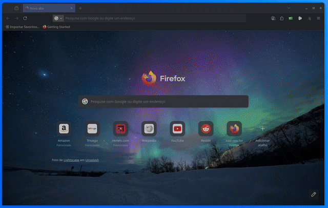

# metatrader_in_container
Run MT5 in a Docker container.  

This project runs the MT5 application inside a Docker container using Wine as a compatibility layer. The container typically consumes around 600MB of RAM. It's possible to run multiple containers simultaneously, each with a separate MT5 account.  
An optional watchdog ensures that if MT5 crashes, the container exits as well, allowing Docker to automatically restart it and maintain uptime.





# Getting Stated
Create a file `docker-compose.yml` with this content:  
``` yaml
services:

  mt5:
    image: hudsonventura/mt5:1.0

    ports:
      - "5901:5901" #VNC
      - "6901:6901" #noVNO (via browser: http://localhost:6901/vnc.html or http://localhost:6901/vnc.html?password=my_vnc_password)

    environment:
     - VNC_PW=my_vnc_password #VNC password. Change it as you like

    volumes:
      - ./.data/MQL5/:/home/headless/.wine/drive_c/Program Files/MetaTrader 5/MQL5/
      - ./mt5.ini:/home/headless/.wine/drive_c/Program Files/MetaTrader 5/mt5.ini
    #  - ./.data/MQL5/servers.dat:/home/headless/.wine/drive_c/Program Files/MetaTrader 5/Config/servers.dat # Uncomment if you ar using a non listed broker
      
    # Optional parameters:
    command: "/start.sh"       # If enabled, the container will shut down when MT5 is closed
    restart: always            # Automatically restarts the container if it stops
    mem_limit: 1536m           # Best practice. The container typically uses around 600MB
```

So:
``` bash
docker compose up
```

## Accessing the container

#### You can access the container via noVNC via browser
Go to this URL and type password manually:
```
http://localhost:6901/vnc.html
```

Or try this link to skip typing the password:
```
http://localhost:6901/vnc.html?password=my_vnc_password
```
#### You can access the container via common VNC client app
Open your favorite VNC client app and use this address:
```
localhost:5901
```


## Versions
Which software can be found inside the container, and what are their versions?  
 - Ubuntu: 24.04.2  
 - Xfce: 4.18.3  
 - Wine: 10.0  
 - MT5: 5.00 build 5147 (auto update)
 - noVNC 1.6.0  
 - TigerVNC 1.15.0  
 - Python 3.12.3  


# Credits / Thanks for:
Acetto: https://github.com/accetto/